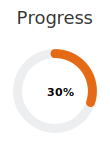
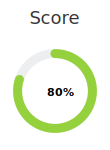

# My Idea

## Problematics

## Solution

## Customer

# How can I improve my idea?
You forgot to identify the hypothesis your faces... bla bla bla

 # My Dashboard
Short sentence explaining the idea.

<table>
	<tbody>
	  <tr>
		<td>
			
		</td>
		<td>
			<b>Customers</b>  
			Short description of who my customers are
		</td>
		<td>
			<b>Problematics</b>  
			List of problematics the customer faces
		</td>
		<td>
			<b>Solutions</b>  
			Short description of what the solution looks like
		</td>
	  </tr>
	  <tr>
		<td>
			
		</td>
		<td>
			<b>Similar projects</b>  
			<a>Find similar projects</a>
		</td>
		<td>
			<b>Hypothesis</b>  
			List of the hypothesis your idea implicitely relies on
		</td>
		<td>
			<b>Verification strategy</b>  
			Your strategy to verif the hypothesis
		</td>
	  </tr>
	</tbody>
</table>
